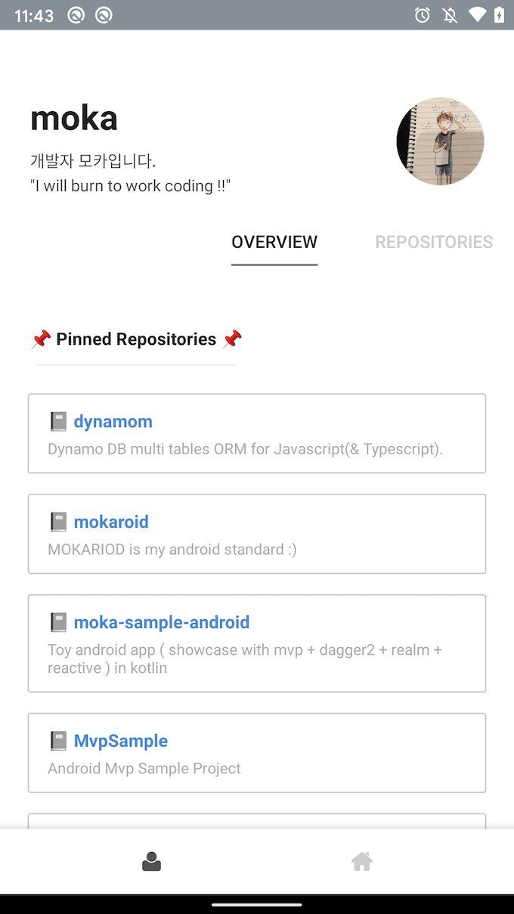
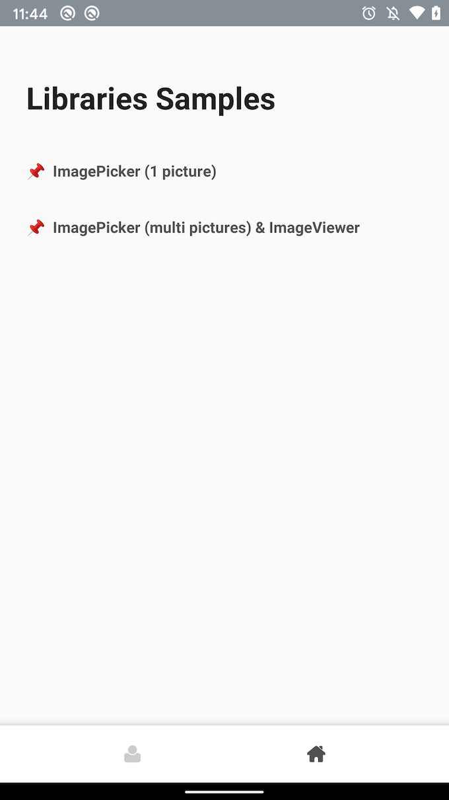

# Sample of architecture

This app is get my profile(moka-a) from github api (graphQL). 

You should Github API key to `/apikey.properties` file. 
`https://github.com/settings/tokens > Personal access tokens > Generate new token > check [read:org]`

If you want to know more information of Github GraphQL Api v4, check [https://developer.github.com/v4/guides/using-the-explorer/](https://developer.github.com/v4/guides/using-the-explorer/)

 
In this app you'll find:

- **Kotlin Coroutines** : Background operations.
- **Navigation component** : A single-activity architecture, to manage fragment operations.
- **MVVM** : A View layer that contains a fragment (View) and a ViewModel per screen (or feature).
- **LiveData** : Reactive UIs using LiveData observables.
- **Apollo GraphQL Client** to call Githubapi.
- **Koin** : dependency injection.

  
  

 

# Example of libraries

- [imagehelper](../../../tree/master/imagehelper/) : ImagePicker / ImageViewer
- [permissionmanager](../../../tree/master/permissionmanager/) : Permission check
- [adhelper](../../../tree/master/adhelper/) : Google Admob, Facebook AudienceNetwork

 
